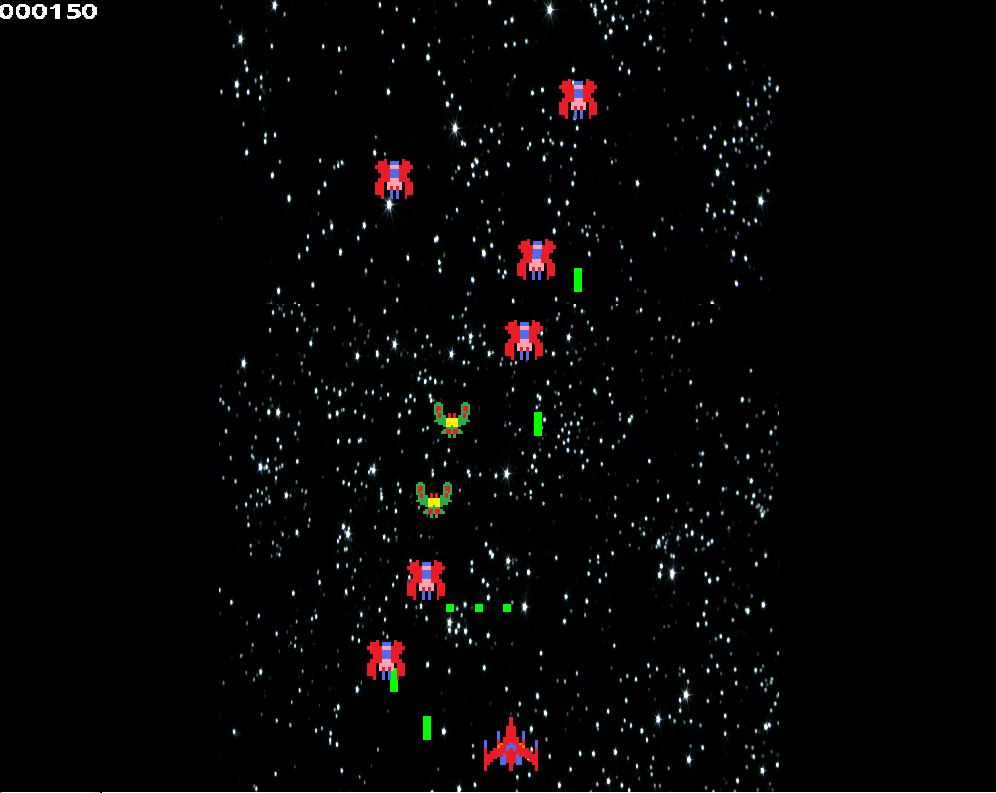
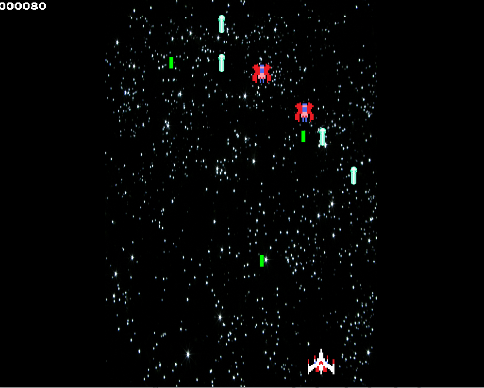
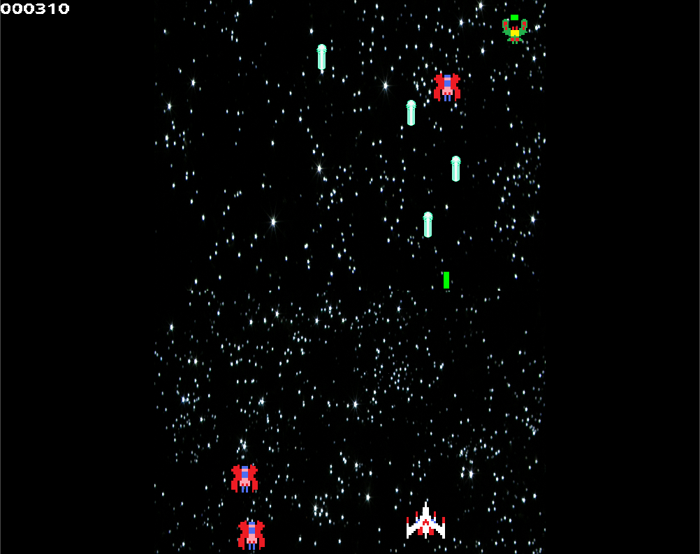

##Bug Destroyer

Petit projet de Shoot Them up en C++ avec la bibliothèque SDL2. 

Pour tester ce projet, il faut avoir la bibliothèque SDL2 installée sur
son ordinateur ainsi que les bibliothèques : SDL_image, SDL_ttf, SDL_mixer 
et compiler le projet pour le système d'exploitation que vous utilisez.

Quelques captures : 

Sprites faits par mammaDX sur deviant art
